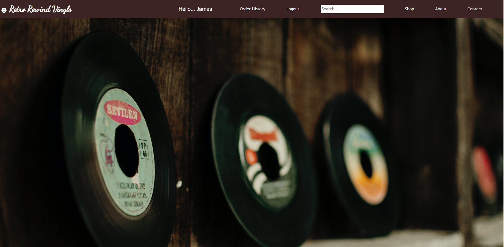

# Retro Rewind Vinyls

## Table of contents

* [Description](#Description)
* [Technologies](#Technologies)
* [Picture Refs](#Picture-Refs)
* [Authors](#Authors)
* [License](#License)

## Description

This E-commerce application will allow a user to find vinyl records by various search parameters including by: artist, genre, and vinyl record title. The application will also allow a user to add an item(s) to a cart, remove item(s) from a cart, and purchase an item(s) using Stripe. So, this application will ultimately assist a user to search through a wide selection of vinyl records directly from a MongoDB database from anywhere the user has a computer available, select the vinyl record(s) the user wishes from the record store's database, and purchase the vinyl record(s) using Stripe.

## Links

Deployed Application: https://calm-brook-71161-f845433ab510.herokuapp.com/ 
GitHub Repository: https://github.com/sctwomey/cautious-parakeet

## Technologies

* HTML
* CSS
* JavaScript
* Visual Studio Code
* Github
* Node.js
* MongoDB
* MongoDB Compass
* MongoDB Atlas
* Mongoose
* Bootstrap
* React
* Apollo Server
* Heroku

## Picture Refs

## Authors

* Zachary Mcdowell
* Stephen Twomey
* Andrew Walsh

## License

* MIT License
